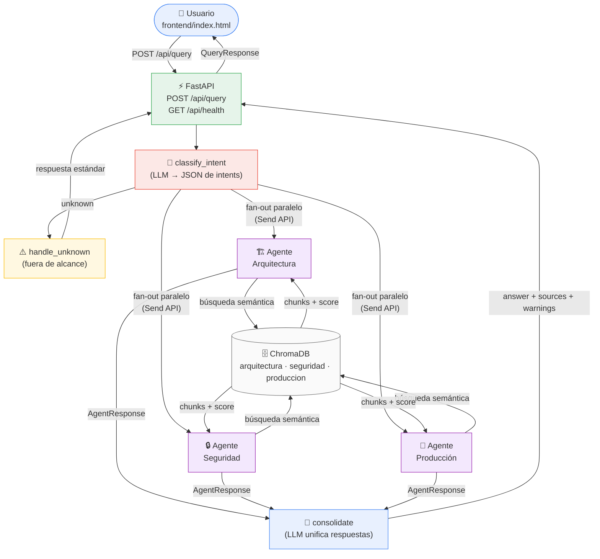

# Mesa de Ayuda IA · Desarrollo TI

Prototipo de mesa de ayuda con agentes especializados de IA para el área de Desarrollo TI de un banco. El sistema recibe preguntas en lenguaje natural y genera respuestas consolidadas, trazables y fundamentadas **exclusivamente** en la base documental institucional.

---

## Arquitectura



### Componentes principales

| Componente | Ubicación | Responsabilidad |
|---|---|---|
| `main.py` | `app/main.py` | Entry point FastAPI, CORS, static files |
| `routes.py` | `app/api/routes.py` | Endpoints REST, logging seguro |
| `graph.py` | `app/orchestrator/graph.py` | LangGraph StateGraph, orquestación |
| `base_agent.py` | `app/agents/base_agent.py` | Clase abstracta extensible |
| `*_agent.py` | `app/agents/` | Agentes especializados (1 por dominio) |
| `retriever.py` | `app/rag/retriever.py` | Búsqueda semántica con score |
| `vectorstore.py` | `app/rag/vectorstore.py` | Cliente ChromaDB, colecciones |
| `llm_factory.py` | `app/llm_factory.py` | Factory de LLM y embeddings |
| `config.py` | `app/config.py` | Configuración desde variables de entorno |
| `ingest.py` | `backend/ingest.py` | Ingesta de documentos en ChromaDB |

---

## Flujo de una consulta

1. El usuario escribe una pregunta en el frontend.
2. `POST /api/query` recibe el `{question}` y genera un `query_id` para trazabilidad.
3. El **orquestador** inicializa el `GraphState` y ejecuta el grafo LangGraph.
4. **`classify_intent`**: un LLM clasifica la pregunta en uno o más dominios (`arquitectura`, `seguridad`, `produccion`) o `unknown`.
5. **Routing condicional**:
   - Si `unknown` → `handle_unknown` → respuesta estándar de "no hay información".
   - Si hay dominios válidos → fan-out paralelo con `Send API` de LangGraph a cada agente relevante.
6. Cada **agente especializado**:
   - Consulta su colección ChromaDB mediante búsqueda semántica con embedding.
   - Si el score de relevancia es menor al umbral → activa `no_info_flag` (sin inventar).
   - Si hay contexto válido → genera respuesta parcial con LLM, anclado a los fragmentos recuperados.
7. **`consolidate`**: otro LLM unifica las respuestas parciales en una respuesta coherente.
   - Si todos los agentes activaron `no_info_flag` → respuesta estándar de "no encontré información".
8. La API devuelve: `answer`, `agents_invoked`, `sources` (con sección y archivo), `warnings`, `query_id`.

---

## Requisitos previos

- Python 3.11+
- Una API key de OpenAI

---

## Setup e instalación

```bash
# 1. Clonar el repositorio y entrar a la raíz
cd prueba-bolivariano/

# 2. Crear y activar entorno virtual (desde la raíz)
python3 -m venv .venv
source .venv/bin/activate       # Linux/macOS
# .venv\Scripts\activate        # Windows

# 3. Instalar dependencias
pip install -r requirements.txt

# 4. Configurar variables de entorno
cp .env.example .env
# Editar .env: colocar la API key

# 5. Ingestar documentos (ejecutar UNA SOLA VEZ o cuando cambien los docs)
python backend/ingest.py

# 6. Iniciar el servidor (desde backend/, con el venv de la raíz activo)
cd backend/
uvicorn app.main:app --reload --host 0.0.0.0 --port 8000
```

Abrir el navegador en: **http://localhost:8000**

La documentación Swagger está disponible en: **http://localhost:8000/api/docs**

---

## Configuración del LLM

El sistema usa OpenAI. Las variables relevantes en `.env`:

| Variable | Descripción | Default |
|---|---|---|
| `OPENAI_API_KEY` | API key de OpenAI | *(requerida)* |
| `LLM_MODEL` | Modelo de chat | `gpt-4o-mini` |
| `EMBEDDING_MODEL` | Modelo de embeddings | `text-embedding-3-small` |

**Costo estimado:** una consulta típica con `gpt-4o-mini` + `text-embedding-3-small` consume 800-2000 tokens (aprox. 0.0003 - 0.001 USD). La ingesta inicial de los 3 documentos son aprox. 5000 tokens de embedding (aprox. 0.0001 USD, pago único).

---

## Ejecutar tests

```bash
# Con el venv de la raíz activo
cd backend/
pytest tests/ -v
```

Los tests usan mocks de OpenAI y ChromaDB: **no requieren API key real** para correr.

---

## Estructura de archivos

```
prueba-bolivariano/          ← raíz del repositorio
├── requirements.txt         ← dependencias del proyecto
├── .env.example             ← plantilla de variables de entorno
├── .gitignore
├── README.md
├── backend/
│   ├── app/
│   │   ├── __init__.py
│   │   ├── main.py
│   │   ├── config.py
│   │   ├── models.py
│   │   ├── llm_factory.py   ← clientes ChatOpenAI y OpenAIEmbeddings
│   │   ├── api/
│   │   │   ├── __init__.py
│   │   │   └── routes.py
│   │   ├── orchestrator/
│   │   │   ├── __init__.py
│   │   │   └── graph.py
│   │   ├── agents/
│   │   │   ├── __init__.py
│   │   │   ├── base_agent.py
│   │   │   ├── architecture_agent.py
│   │   │   ├── security_agent.py
│   │   │   └── production_agent.py
│   │   └── rag/
│   │       ├── __init__.py
│   │       ├── vectorstore.py
│   │       └── retriever.py
│   ├── docs/                ← Los 3 documentos TXT del banco
│   ├── tests/
│   │   ├── conftest.py
│   │   ├── __init__.py
│   │   ├── test_agents.py
│   │   └── test_orchestrator.py
│   ├── ingest.py
│   └── pytest.ini
├── frontend/
│   └── index.html
└── .venv/                   ← entorno virtual (no versionado)
```

---

## Decisiones técnicas y trade-offs

### LangGraph para orquestación
**Por qué:** Permite definir el flujo como un grafo de estado explícito, con paralelización nativa (Send API), routing condicional tipado y trazabilidad de cada nodo. Es el estándar emergente para agentes IA en producción.
**Trade-off:** Mayor complejidad inicial comparado con una cadena LangChain simple. Justificado porque la paralelización y el routing condicional son requisitos del caso de uso.

### ChromaDB con colecciones separadas
**Por qué:** Una colección por documento permite que cada agente acceda **únicamente a su dominio**, implementando el control de acceso documental a nivel de vectorstore. Si un usuario no tiene permiso para un documento, simplemente no se incluye su colección en la búsqueda.
**Trade-off:** Más colecciones comparado a un filtrado por metadatos en una sola colección. La separación es más robusta y menos propensa a errores de filtrado.

### Clasificación de intención por LLM
**Por qué:** Más robusto que keywords para consultas ambiguas o mixtas. El LLM entiende semántica, no solo palabras clave.
**Trade-off:** Costo adicional de tokens vs. clasificador de keywords gratuito. Para un banco, la robustez justifica el costo mínimo, más si se usan modelos ligeros.

### Control de alucinaciones (RAG + umbral + guardrail en LLM)
Doble capa:
1. **Umbral de relevancia en ChromaDB** (`RAG_RELEVANCE_THRESHOLD`): si ningún chunk supera el umbral, el agente no llama al LLM y activa `no_info_flag` directamente.
2. **Instrucción explícita en el prompt**: se le indica al LLM que si los fragmentos no son suficientes, responda con la frase estándar, la cual el agente detecta para activar el flag.

### `llm_factory.py`: clientes OpenAI centralizados
**Por qué:** `get_llm()` y `get_embeddings()` son singletons con `@lru_cache` que el resto de la app importa directamente. Si en el futuro se cambia de modelo o proveedor, el cambio está en un solo lugar.

---

## Control de acceso documental (propuesta)

La arquitectura actual ya está preparada para agregar permisos por documento:

1. Cada colección ChromaDB corresponde a un documento con su nivel de clasificación.
2. Al recibir una consulta, se filtra `AGENT_REGISTRY` según el perfil del usuario autenticado.
3. Solo se invocan agentes cuya colección esté autorizada para ese perfil.

Implementación futura sugerida:
- Agregar autenticación JWT en el endpoint `/api/query`.
- Definir un mapa `{rol: [colecciones_permitidas]}` en configuración.
- Filtrar `AGENT_REGISTRY` en `route_after_classify` según el rol del token.

---

## Extensibilidad

### Cómo agregar un nuevo agente

1. Crear `backend/app/agents/nuevo_agente.py` extendiendo `BaseAgent`.
2. Definir `agent_name`, `collection_name` y `system_prompt`.
3. Agregar una entrada en `AGENT_REGISTRY` en `graph.py`.
4. Registrar el nombre de colección en `vectorstore.py`.
5. Ingestar el nuevo documento con `ingest.py`.
6. Actualizar el system prompt del clasificador en `graph.py` para incluir el nuevo dominio.

No hay más cambios necesarios en el resto de la arquitectura.

---

## Logging seguro

El sistema registra los siguientes campos (nunca el contenido de preguntas o respuestas):

| Campo | Descripción |
|---|---|
| `query_id` | UUID único por consulta |
| `question_len` | Longitud de la pregunta (no el texto) |
| `agents_invoked` | Lista de agentes que participaron |
| `sources` | Número de fuentes recuperadas |
| `warnings` | Número de advertencias |
| `error_type` | Tipo de excepción (nunca stack trace completo al cliente) |

---

## Monitoreo propuesto (producción)

| Métrica | Herramienta sugerida |
|---|---|
| Latencia por consulta y por agente | Grafana |
| Tokens consumidos y costo estimado | LangSmith o logging propio |
| Tasa de respuestas con `no_info_flag` | Dashboard interno |
| Errores del LLM (timeouts, rate limits) | Alertas en CloudWatch / Datadog |
| Feedback de usuarios (útil / no útil) | Endpoint `POST /api/feedback` + tabla BD |
| Consultas fuera de alcance (unknown) | Análisis semanal para ampliar base documental |

---

## Riesgos conocidos

| Riesgo | Mitigación |
|---|---|
| Alucinación del LLM | Doble guardrail: umbral RAG + instrucción en prompt |
| Prompt injection | Input sanitizado por Pydantic; agentes no ejecutan acciones, solo generan texto |
| Exposición de API key | Solo en variables de entorno; `.env` en `.gitignore` |
| Costo por uso intensivo | `gpt-4o-mini` minimiza costo; monitoreo de tokens propuesto |
